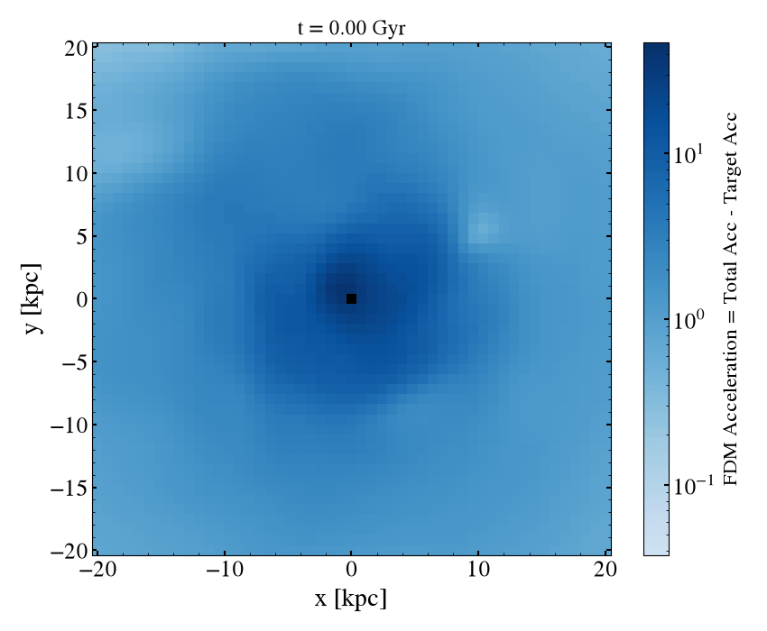

The following instructions will get you up and running on the code:

1. Clone this branch of the repo by running the following in your terminal: 
```bash
git clone -b WidrowKaiserFDM --single-branch https://github.com/sgpfaff/tambora.git
```

1. Once cloned, make sure that you're in the home directory of the repo. After this, you will activate the virtual environment I've added by inputing the following in your terminal:

```bash
source fdmEnv/bin/activate
```

> This virtual environment basically has all of the dependenanies you need to run the code already installed. This includes the unreleased versions of tambora and galpy.

Once activated, you should be able to run any python files and the `fdmEnv` should be available as a kernel in jupyter notebooks.